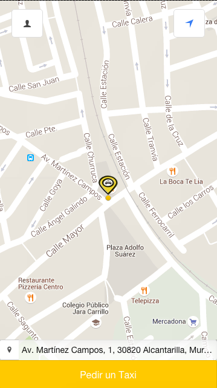
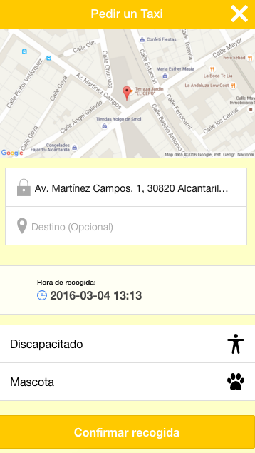
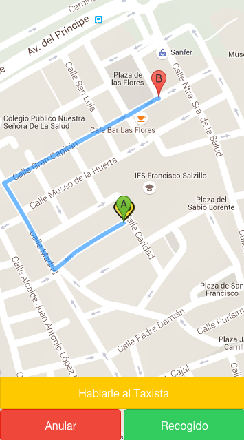

TaxiApp
=====================

Aplicación para taxistas creada con Ionic/PhoneGap

## Server

La aplicación se conecta con un servidor Nodejs y utiliza la librería de Sails.io para actualizar al instante el movimiento de los coches.

